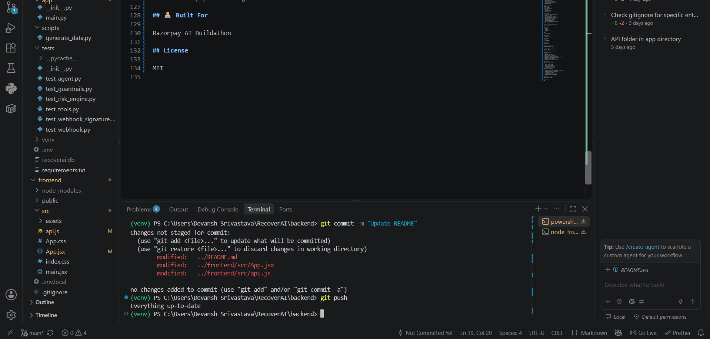

# RecoverAI

### AI-Powered Revenue Recovery Engine

RecoverAI is an intelligent payment recovery platform that identifies
failed payments, evaluates recovery potential, prioritizes recovery
opportunities, and recommends the most suitable recovery action.

## 🚨 Problem

Payment failures create significant revenue leakage for businesses.

Traditional systems treat failed payments as isolated transaction
failures and often lack intelligent prioritization.

RecoverAI transforms failed payments into actionable recovery
opportunities.

## 💡 Solution

RecoverAI combines:

- Payment failure detection
- Customer analysis
- Risk scoring
- Recovery probability
- Revenue-at-risk calculation
- Opportunity prioritization
- AI-powered recovery recommendations
- Recovery tracking

## 🧠 How It Works

Failed Payment
→ Risk Analysis
→ Recovery Probability
→ Opportunity Score
→ Priority
→ AI Recommendation
→ Recovery
→ Recovered Revenue

## ✨ Features

- AI-powered recovery recommendations
- Payment risk scoring
- Recovery probability prediction
- Revenue-at-risk calculation
- Recovery opportunity prioritization
- Automated recovery tracking
- Razorpay webhook integration
- FastAPI backend
- Interactive dashboard
- REST APIs with Swagger documentation

## 🏗️ Architecture

[Put your architecture diagram here]

## 🛠️ Tech Stack

### Backend
- Python
- FastAPI
- SQLAlchemy
- PostgreSQL
- Uvicorn

### AI
- Google Gemini
- AI Recovery Agent

### Payments
- Razorpay
- Razorpay Webhooks

### Frontend
- React
- Vite
- Tailwind CSS

## 📊 Example

Risk Score: 73

Recovery Probability: 74.75%

Revenue at Risk: ₹4,999

Expected Recovery: ₹3,736.75

Priority: MEDIUM

Recommended Action: RETRY_PAYMENT

## 🔄 Recovery Flow

1. Payment fails
2. Razorpay sends webhook
3. RecoverAI records the failure
4. Risk Engine evaluates the payment
5. Opportunity Engine calculates recovery value
6. AI Recovery Agent recommends an action
7. Recovery action is executed
8. Payment status is updated
9. Dashboard reflects recovered revenue

## 🎯 Impact

RecoverAI helps businesses:

- Reduce revenue leakage
- Prioritize high-value failed payments
- Improve payment recovery
- Automate recovery decisions
- Increase recovered revenue

## 🚀 Future Improvements

- Multi-channel recovery through email/SMS/WhatsApp
- ML-based recovery probability model
- Customer lifetime value integration
- Intelligent retry timing
- A/B testing of recovery strategies
- Advanced analytics
- Automated payment-link generation

## 👨‍💻 Built For

Razorpay AI Buildathon

## License

MIT
